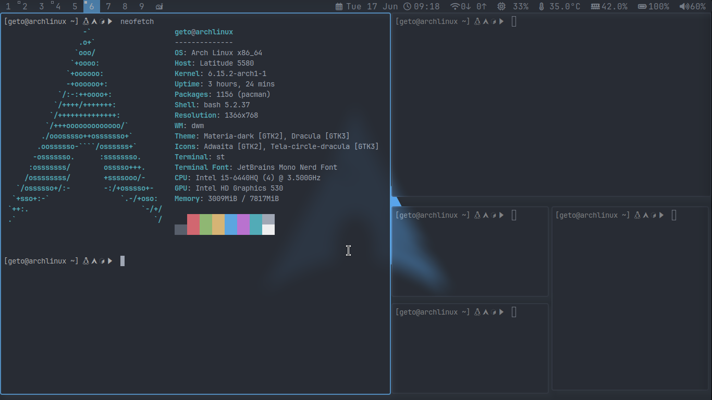
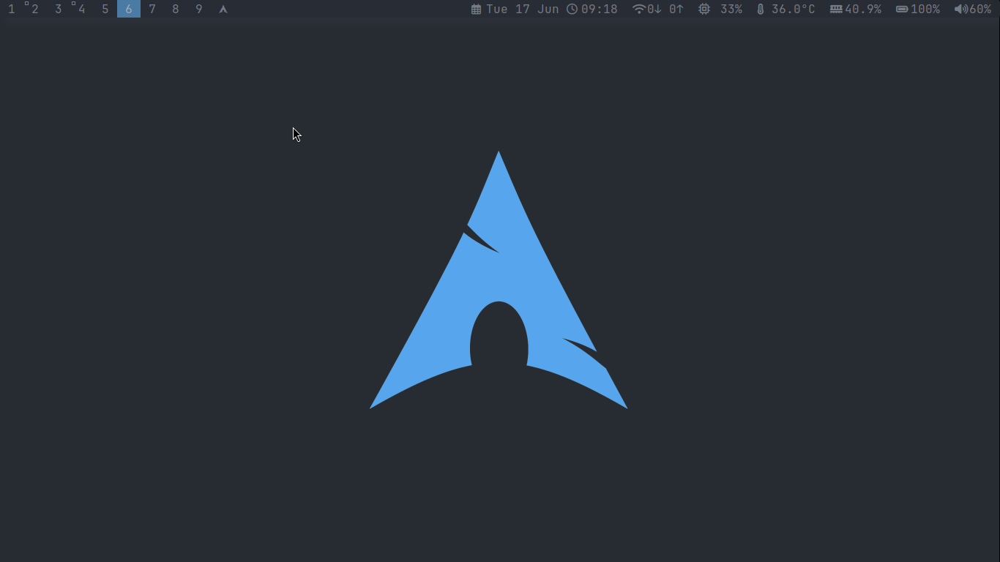

# My Suckless Tools

This repository contains my personal builds and configurations for various [suckless.org](https://suckless.org) tools, customized with my **One Dark Pro** and **Minimal** themes.

## 📂 Included Tools

- **dwm** — Dynamic window manager with One Dark Pro and Minimal themes.
- **st** — Simple terminal with matching colorscheme.
- **slstatus** — Lightweight status monitor styled to fit the themes.
- **dmenu** — Dynamic menu with theme-consistent colors.

## 🎨 Themes

- **One Dark Pro** — Inspired by the popular VS Code theme, with a dark, modern look.
- **Minimal** — A clean, distraction-free variant with subtle colors.

You can switch or tweak these themes easily by editing `config.h` in each tool’s folder.

## 🖼️ Screenshots




> 📸 **Tip:** Place your screenshots inside an `images/` folder in the repo.

## ⚡ Installation

Each tool follows the usual suckless build pattern:

```bash
cd TOOLNAME
sudo make clean install

For example, to install my dwm:

cd dwm
sudo make clean install

🛠️ Customization

    My configurations are in config.h inside each tool’s folder.

    Feel free to fork and adapt them to your needs.

📜 License

This configuration is under the MIT license — see LICENSE for details.

📬 Contact

Maintained by Ayad.M.
